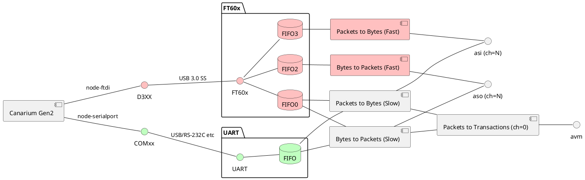
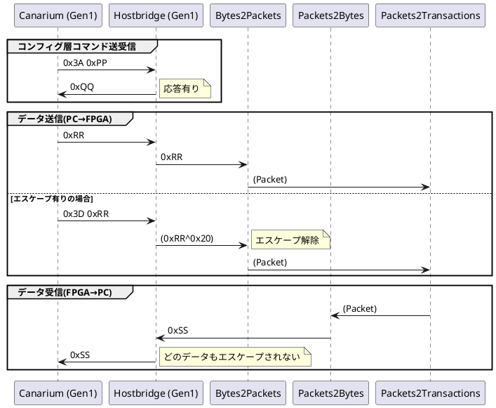
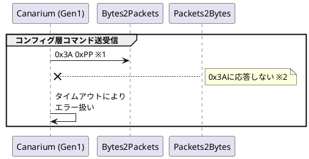
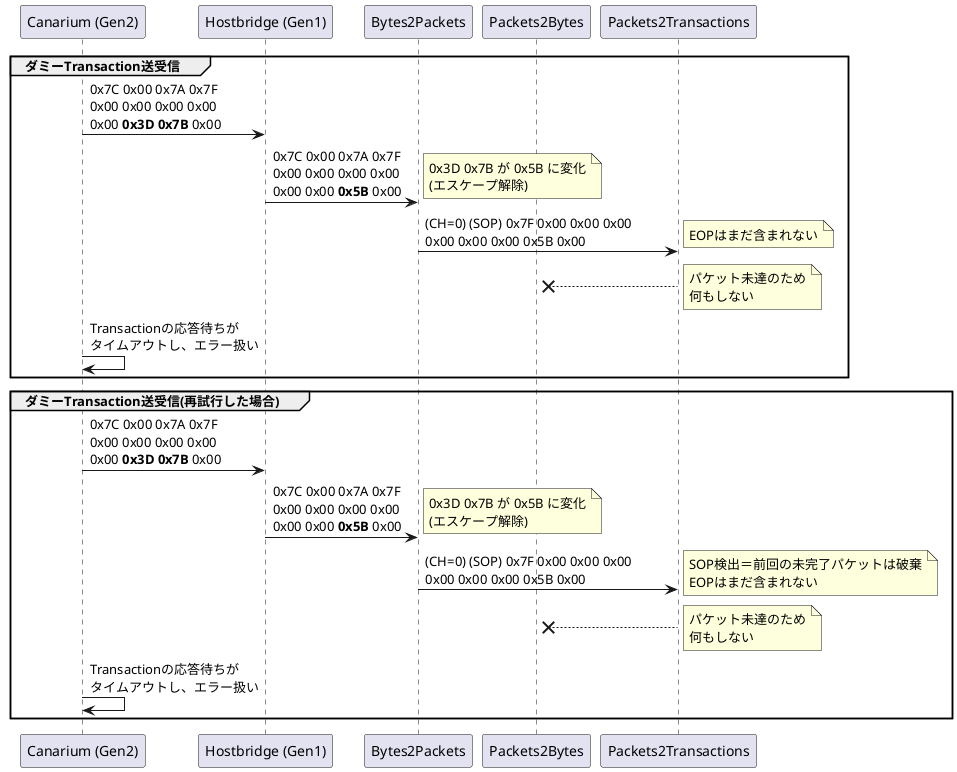
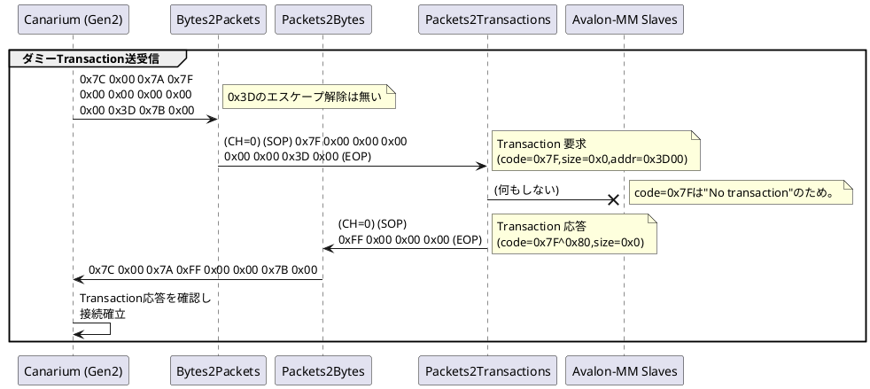

Canarium Gen2 通信プロトコル
========

Canarium Gen2 プロトコルは、FPGAとPCを1対1で接続し、以下の通信を可能とする。
- [必須] PC→FPGAへのAvalon MMトランザクション発行 (Canarium Gen1と同等の機能)
- [省略可] PC←→FPGA間の双方向バイトストリーム(256本、1バイトは8bit固定)
  - Ch0～Ch7 : Canarium側で用途を固定(予約)、うちCh0は上記のAVMトランザクション実装に利用。
  - Ch8～Ch255 : ユーザー定義

構成
--------

補足説明
* **赤色の要素**はFT60xによる多チャンネルFIFOを通信層に用いる場合のみ有効な要素
* **緑色の要素**はRS232Cなど単一の双方向FIFOを通信層に用いる場合のみ有効な要素
* **黄色の要素**は通信層の実装方法にかかわらず共通の要素
* Avalon-STのMuxは図から割愛している
* aso/asiが不要な場合、右半分は完全にソフトウェアによるエミュレーションで実装することも可能とする。

バイトストリームのプロトコル
--------

Avalon-ST Bytes to Packets / Packets to Bytes のバイトストリームに同じ。 
(詳細はインテルの資料 UG-01085 を参照)

旧プロトコルとの組み合わせ
--------

### 1. Gen1同士

従来通り通信可能。Gen2の機能は使えない(当然)。

### 2. Canariumが古い場合

通信不可能。古いCanariumからは新しいHostbridgeを認識できず、接続が成立しない。

※1) 接続試行の段階ではnCONFIG=Hとするため、0xPPのbit0は常に1。 
よって0xPPが0x7Aや0x7Cとなることはあり得ない。よって、チャネル選択もSOPも生成され得ない。

※2) これを満たすためには、FPGA側は電源投入後～Canariumとの接続成立までの間に、 自発的にデータを送出してはならない。

### 3. Hostbridgeが古い場合

通信不可能。新しいCanariumからは古いHostbridgeを認識できず、接続が成立しない。

### 4. Gen2同士

通信可能。Gen2の機能を利用できる。

